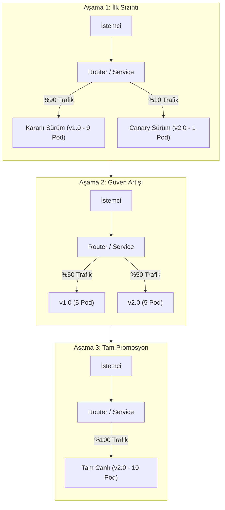

# Canary trafik aşamaları

[Blue-Green ve Canary labına dön](../README.md)

```mermaid
%%{init: {'themeVariables': {'fontSize': '18px'}, 'flowchart': {'nodeSpacing': 36, 'rankSpacing': 48}}}%%
flowchart TB
  accTitle: Canary trafik aşamaları
  accDescr: Yeni sürüme ayrılan trafiğin kademeli biçimde artırılmasını gösterir.
  subgraph C_Phase1["Aşama 1: İlk Sızıntı"]
    direction TB
    CLI1["İstemci"] --> LB1["Router / Service"]
    LB1 -->|%90 Trafik| V1_STABLE["Kararlı Sürüm (v1.0 - 9 Pod)"]
    LB1 -->|%10 Trafik| V2_CANARY["Canary Sürüm (v2.0 - 1 Pod)"]
  end
  subgraph C_Phase2["Aşama 2: Güven Artışı"]
    direction TB
    CLI2["İstemci"] --> LB2["Router / Service"]
    LB2 -->|%50 Trafik| V1_50["v1.0 (5 Pod)"]
    LB2 -->|%50 Trafik| V2_50["v2.0 (5 Pod)"]
  end
  subgraph C_Phase3["Aşama 3: Tam Promosyon"]
    direction TB
    CLI3["İstemci"] --> LB3["Router / Service"]
    LB3 -->|%100 Trafik| V2_FULL["Tam Canlı (v2.0 - 10 Pod)"]
  end
  C_Phase1 --> C_Phase2 --> C_Phase3
```
