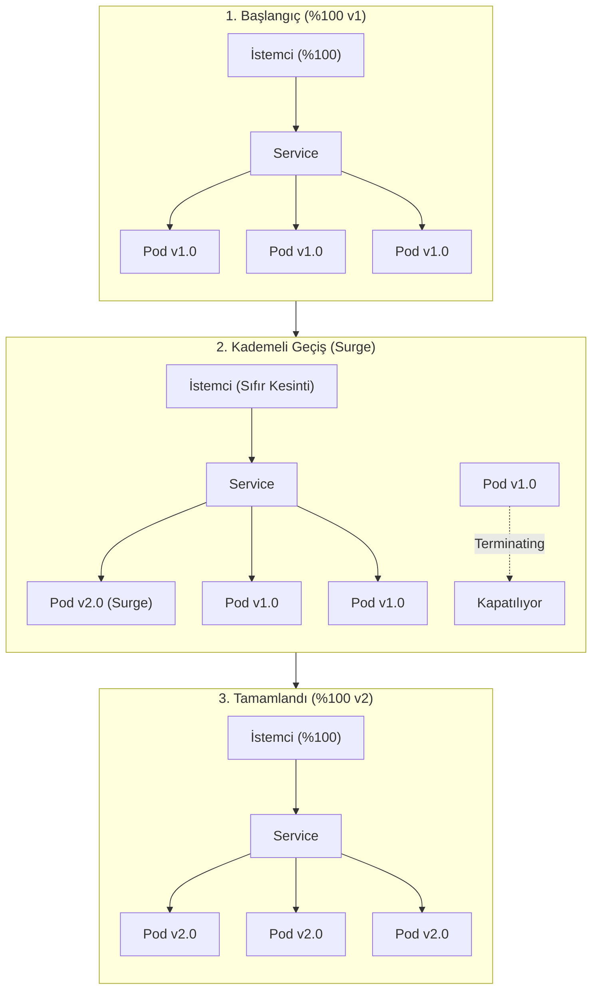

# RollingUpdate dağıtım aşamaları

[Recreate ve RollingUpdate labına dön](../README.md)

```mermaid
%%{init: {'themeVariables': {'fontSize': '18px'}, 'flowchart': {'nodeSpacing': 36, 'rankSpacing': 48}}}%%
flowchart TB
  accTitle: RollingUpdate dağıtım aşamaları
  accDescr: RollingUpdate sırasında eski ve yeni podların sıfır kesintiyle kademeli değişimini gösterir.
  subgraph R1["1. Başlangıç (%100 v1)"]
    direction TB
    CR1["İstemci (%100)"] --> SR1["Service"]
    SR1 --> PA["Pod v1.0"] & PB["Pod v1.0"] & PC["Pod v1.0"]
  end
  subgraph R2["2. Kademeli Geçiş (Surge)"]
    direction TB
    CR2["İstemci (Sıfır Kesinti)"] --> SR2["Service"]
    SR2 --> PN["Pod v2.0 (Surge)"] & PB2["Pod v1.0"] & PC2["Pod v1.0"]
    PA2["Pod v1.0"] -.->|Terminating| T["Kapatılıyor"]
  end
  subgraph R3["3. Tamamlandı (%100 v2)"]
    direction TB
    CR3["İstemci (%100)"] --> SR3["Service"]
    SR3 --> P2A["Pod v2.0"] & P2B["Pod v2.0"] & P2C["Pod v2.0"]
  end
  R1 --> R2 --> R3
```
