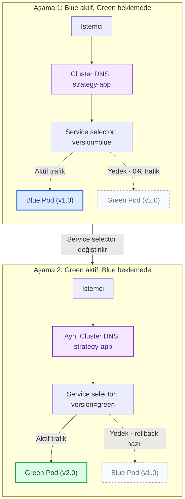

# Blue-Green trafik geçişi

[Lab 8'e dön](../README.md)

```mermaid
%%{init: {'themeVariables': {'fontSize': '22px'}, 'flowchart': {'nodeSpacing': 48, 'rankSpacing': 64, 'useMaxWidth': false}}}%%
flowchart TB
  accTitle: Blue-Green trafik geçişi
  accDescr: Aynı Kubernetes Service DNS adı üzerinden önce Blue sürümüne, sonra Service selector değişince Green sürümüne trafik aktarımını gösterir.
  subgraph Stage1["Aşama 1: Blue aktif, Green beklemede"]
    direction TB
    CB["İstemci"] --> DNS1["Cluster DNS: strategy-app"] --> SB["Service selector: version=blue"]
    SB -->|Aktif trafik| B1["Blue Pod (v1.0)"]
    SB -.->|Yedek · 0% trafik| G1["Green Pod (v2.0)"]
  end
  subgraph Stage2["Aşama 2: Green aktif, Blue beklemede"]
    direction TB
    CG["İstemci"] --> DNS2["Aynı Cluster DNS: strategy-app"] --> SG["Service selector: version=green"]
    SG -->|Aktif trafik| G2["Green Pod (v2.0)"]
    SG -.->|Yedek · rollback hazır| B2["Blue Pod (v1.0)"]
  end
  Stage1 -->|Service selector değiştirilir| Stage2

  classDef dns fill:#f3e8ff,stroke:#7e22ce,stroke-width:2px,color:#581c87
  classDef blue fill:#dbeafe,stroke:#2563eb,stroke-width:3px,color:#1e3a8a
  classDef green fill:#dcfce7,stroke:#16a34a,stroke-width:3px,color:#14532d
  classDef standby fill:#f8fafc,stroke:#94a3b8,stroke-width:2px,stroke-dasharray:5 5,color:#64748b
  class DNS1,DNS2 dns
  class B1 blue
  class G2 green
  class B2,G1 standby
```
