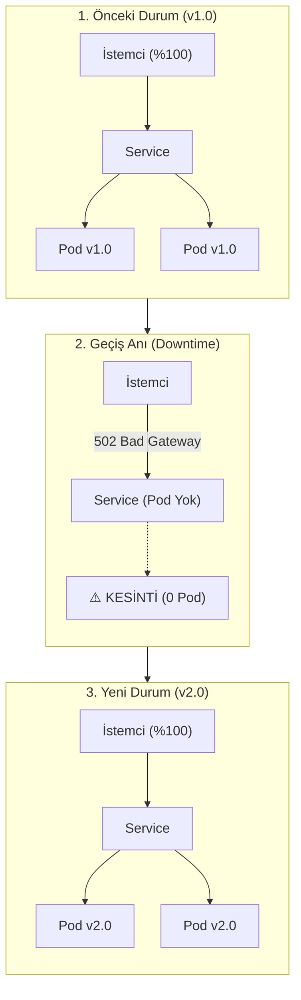

# Recreate dağıtım aşamaları

[Lab 8'e dön](../README.md)

```mermaid
%%{init: {'themeVariables': {'fontSize': '18px'}, 'flowchart': {'nodeSpacing': 36, 'rankSpacing': 48}}}%%
flowchart TB
  accTitle: Recreate dağıtım aşamaları
  accDescr: Eski sürümün çalışmasından kesinti anına ve yeni sürüme geçişi gösterir.
  subgraph S1["1. Önceki Durum (v1.0)"]
    direction TB
    C1["İstemci (%100)"] --> SRV1["Service"]
    SRV1 --> P1A["Pod v1.0"] & P1B["Pod v1.0"]
  end
  subgraph S2["2. Geçiş Anı (Downtime)"]
    direction TB
    C2["İstemci"] -->|502 Bad Gateway| SRV2["Service (Pod Yok)"]
    SRV2 -.-> X["⚠️ KESİNTİ (0 Pod)"]
  end
  subgraph S3["3. Yeni Durum (v2.0)"]
    direction TB
    C3["İstemci (%100)"] --> SRV3["Service"]
    SRV3 --> P2A["Pod v2.0"] & P2B["Pod v2.0"]
  end
  S1 --> S2 --> S3
```
